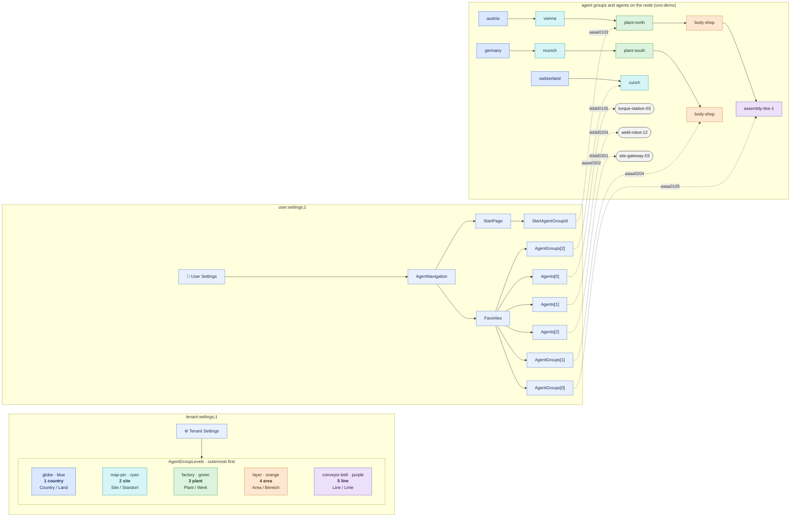

# Heimdall UI settings demo — graph representation

Companion diagram for [heimdall-ui-settings-demo.json](heimdall-ui-settings-demo.json): the tenant
settings (`heimdall:ui:tenant:settings;1`) and one user's settings (`heimdall:ui:user:settings;1`)
of the `nordstern-motors` tenant from [uns-demo.md](uns-demo.md). Both are Heimdall documents, not
twins on the node; they refer to agent groups and agents by twin id only.

## Graph

Solid edges are document structure, dashed edges are twin-id references into the node's topology.
An agent group takes its level's color and icon from its depth below the enrollment group, not
from an edge.

## What the demo shows

- **Levels style depth, not groups.** `AgentGroupLevels` holds five entries, one per depth 1..5;
  no level lists its agent groups.
- **`Name` is the identifier, labels are localized.** `plant` stays `plant`; `DisplayNames` carries
  `Plant` / `Werk`.
- **Favorites cross branches and depths.** The user stars a level-5 line in Austria, a level-4
  area in Germany and a level-2 site in Switzerland; the array order is the display order.
- **Agents are starred separately.** `Favorites.Agents` holds agents by twin id, next to
  `Favorites.AgentGroups`; each list takes at most 25 entries.
- **The start page is independent of favorites.** The agents section opens on `plant-north`,
  which is not starred.
- **References are plain twin ids.** Deleting an agent group or agent on the node leaves a
  dangling id in the user document; the client has to tolerate it.
