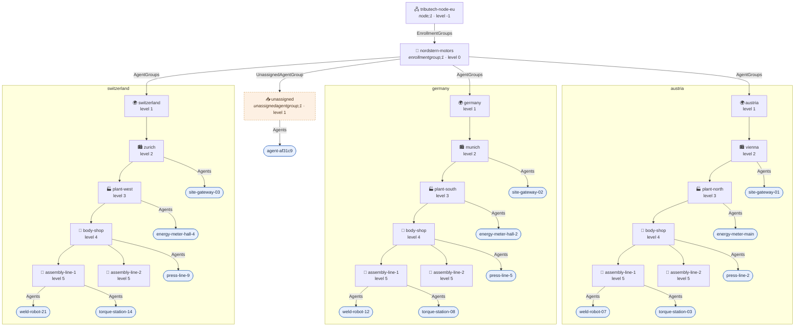

# Unified namespace demo — graph representation

Companion diagram for [uns-demo.json](uns-demo.json). One enrollment group of a car manufacturer,
nested by geolocation from a country down to an assembly line — the maximum legal agent group
level of 5, with its agents one hop below at level 6. Three balanced country branches show that the
same path segment (`body-shop`, `assembly-line-1`) is only required to be unique among its siblings.

Levels are counted **from the enrollment group, which is level 0**: agent groups occupy levels 1..5
and agents sit at level 6 at the deepest.

## Graph

Unlabelled edges inside a country branch are `ChildAgentGroups`.

## Namespace paths

The `Name` of each agent group is a path segment; the path is the chain of `ChildAgentGroups` names
below the enrollment group. All paths below are prefixed with `nordstern-motors`.

| Agent | Namespace path |
|---|---|
| `weld-robot-07`, `torque-station-03` | austria › vienna › plant-north › body-shop › assembly-line-1 |
| `press-line-2` | austria › vienna › plant-north › body-shop |
| `energy-meter-main` | austria › vienna › plant-north |
| `site-gateway-01` | austria › vienna |
| `weld-robot-12`, `torque-station-08` | germany › munich › plant-south › body-shop › assembly-line-1 |
| `press-line-5` | germany › munich › plant-south › body-shop |
| `energy-meter-hall-2` | germany › munich › plant-south |
| `site-gateway-02` | germany › munich |
| `weld-robot-21`, `torque-station-14` | switzerland › zurich › plant-west › body-shop › assembly-line-1 |
| `press-line-9` | switzerland › zurich › plant-west › body-shop |
| `energy-meter-hall-4` | switzerland › zurich › plant-west |
| `site-gateway-03` | switzerland › zurich |
| `agent-af31c9` | unassigned |

## What the demo shows

- **Level 5 is the deepest legal agent group.** The `assembly-line-*` groups sit there; creating a
  child below any of them is rejected.
- **Agents consume no level of their own.** `weld-robot-07` hangs off a level-5 group and lands at
  level 6 — the deepest anything gets, and the maximum of the `depth` parameter.
- **Path segments are unique among siblings, not globally.** All three countries carry a
  `body-shop` and an `assembly-line-1`; only the full path disambiguates them.
- **Agents may sit on any level, not only on leaves.** In every country three agents are filed on
  the intermediate city, plant and shop groups — a site gateway, a plant energy meter and a shop
  press line each belong to their level rather than to a line.
- **An agent group may be empty.** `assembly-line-2` exists in each country with no agents.
- **Uncategorized agents are a real node, not a computed set.** `agent-af31c9` was activated without
  an agent group, so it holds an ordinary `Agents` edge from the reserved `unassigned` group. The
  enrollment group itself never holds `Agents` edges.
- **Labels are localized, paths are not.** Every group carries `en`/`de` `DisplayNames`; the `Name`
  that forms the path stays untranslated, so `zurich` resolves identically in either locale.
- **The node twin is level -1.** It is reachable only with `startOffset=-1`, and then carries only
  the one `EnrollmentGroups` edge that leads to the caller's own enrollment group.

## Size

| Element | Count |
|---|---|
| Node twins | 1 |
| Enrollment groups | 1 |
| Agent groups (incl. the reserved `unassigned`) | 19 |
| Agents | 16 |
| **Twins total** | **37** |
| Relationships | 36 |
| **Graph elements total** | **73** |
